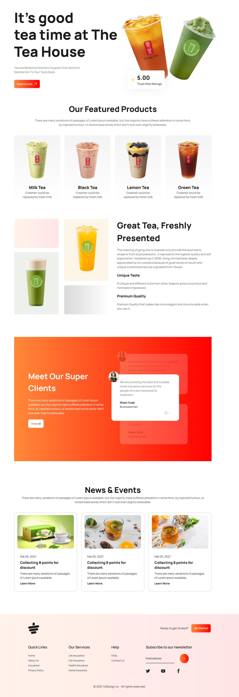

# Tea House

Welcome to the **Tea House** landing page! This project is a responsive and visually appealing landing page designed to showcase the elegance of tea culture. It provides a smooth user experience and is optimized for various devices.

## 🌐 Live Site
Check out the live version here: [Tea House Landing Page](https://awfulasiful.github.io/Tea-house/)

## ✨ Features
- Elegant styling with a warm theme
- User-friendly layout highlighting key aspects of tea culture

## 🚀 Technologies Used
- **HTML**
- **CSS**
- **Tailwind CSS**
- **DaisyUI**

## 📸 Screenshot

> _Screenshot of the Tea House landing page (above)._

## 📝 License
This project is open-source and free to use. Feel free to fork, modify, or contribute!

---

Thank you for visiting the Tea House landing page! Enjoy exploring the art of tea.
